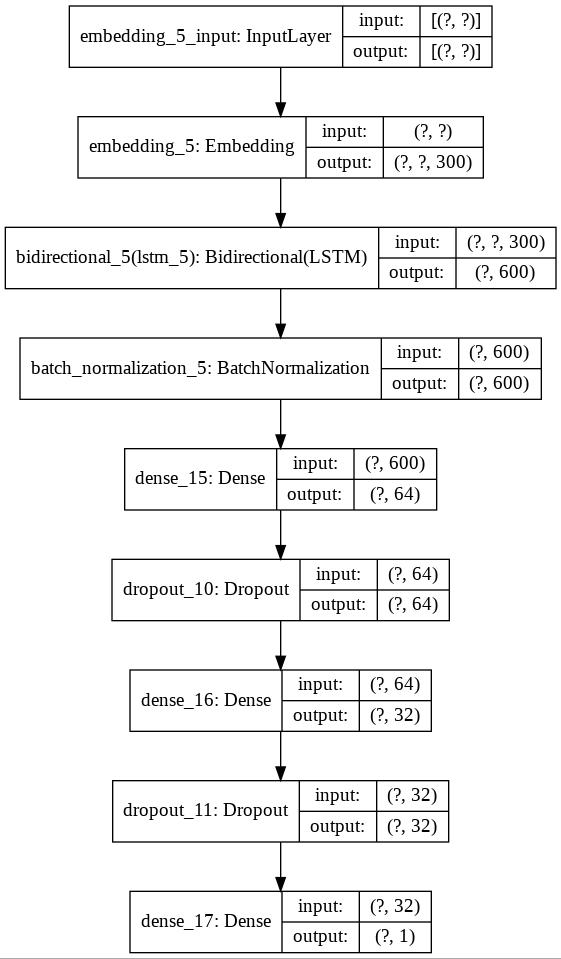
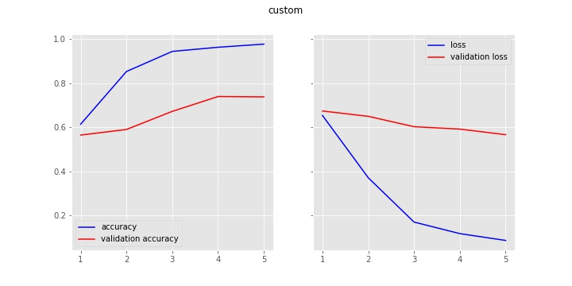
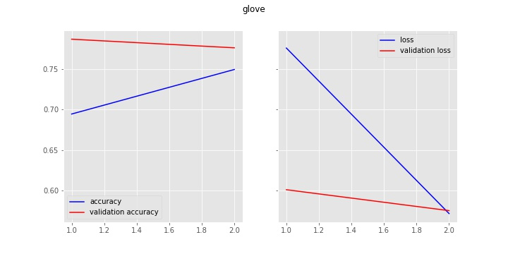
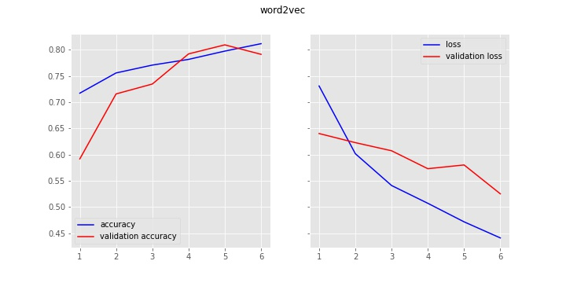

# Real-Or-Not
Submission for Kaggle Contest: https://www.kaggle.com/c/nlp-getting-started
## Following Pre-trained Word Embeddings Used:
* GloVe
* Word2Vec
## Architecture
</img>
## Results
* Custom Embedding Layer
</img>

* GloVe
</img>

* Word2Vec
</img>
